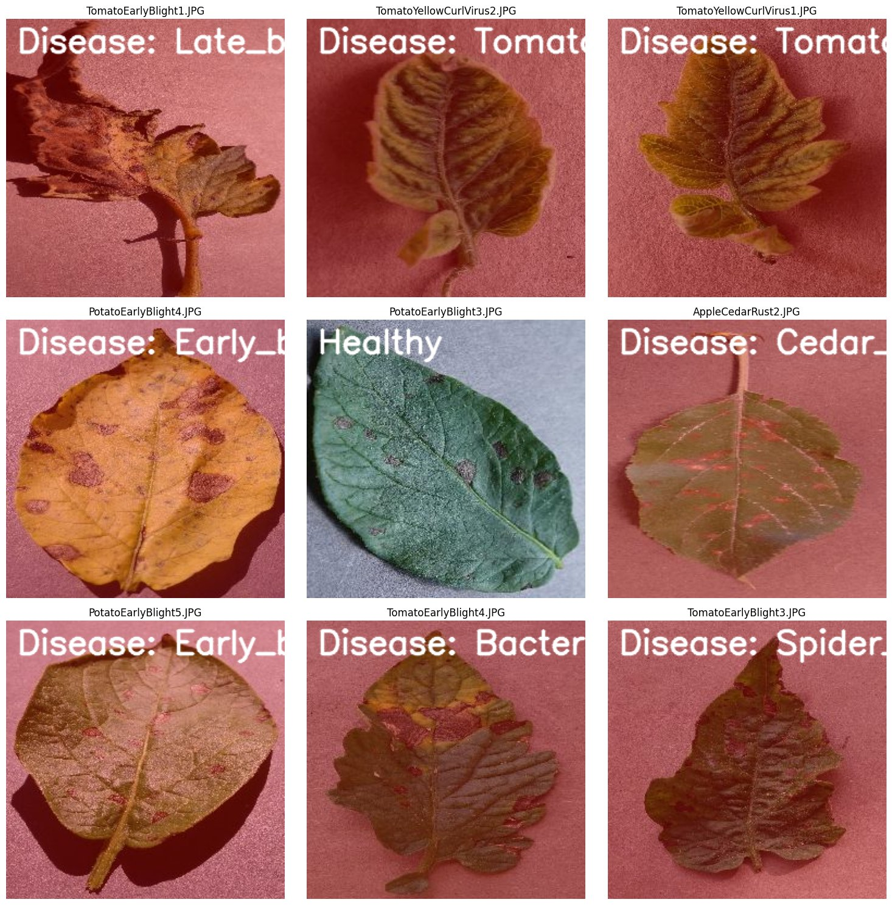
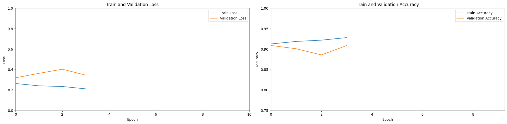
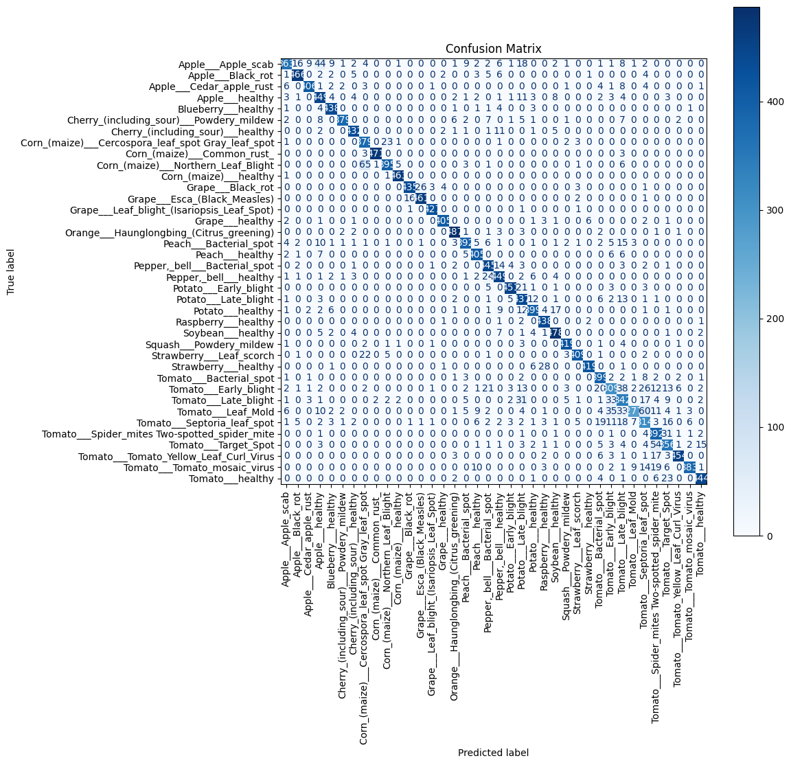

# 🌿 Plant Disease Detection using CNN

A TensorFlow/Keras image classifier that identifies **38 plant/disease categories** from leaf photos and reports whether the plant is **healthy or unhealthy**. It ships with scripts for downloading data, training, evaluation and prediction, plus a **Streamlit web app** you can deploy.

Trained on the Kaggle **[New Plant Diseases Dataset (Augmented)](https://www.kaggle.com/datasets/vipoooool/new-plant-diseases-dataset)** (≈87k images, 14 crops).



---

## Features

- **38-class disease classifier** – apple, blueberry, cherry, corn, grape, orange, peach, bell pepper, potato, raspberry, soybean, squash, strawberry and tomato.
- **Healthy / unhealthy verdict** with confidence and top-3 alternatives.
- **Two architectures** – the original custom CNN, or MobileNetV2 transfer learning (`--arch mobilenetv2`).
- **Reproducible CLI pipeline** – `download_data.py → train.py → evaluate.py → predict.py`.
- **Web app** – upload or photograph a leaf in the browser (`streamlit run app.py`).
- **Deploy anywhere** – Streamlit Community Cloud, Hugging Face Spaces, or Docker.

---

## Project structure

```text
plant-disease-detection/
├── app.py                  # Streamlit web app
├── download_data.py        # download + organise the Kaggle dataset
├── train.py                # train the model
├── evaluate.py             # metrics, classification report, confusion matrix
├── predict.py              # predict on images / folders from the command line
├── plant_disease/          # reusable library code
│   ├── config.py           #   paths & hyperparameters
│   ├── data.py             #   dataset download / extraction / tf.data loaders
│   ├── model.py            #   CNN + MobileNetV2 architectures
│   ├── inference.py        #   PlantDiseasePredictor + label parsing
│   └── plots.py            #   training curves, confusion matrix, prediction grid
├── models/                 # trained model + class_names.json (created by train.py)
├── outputs/                # plots, reports, metrics (created by the scripts)
├── notebooks/              # original Colab notebook (for reference)
├── docs/images/            # figures used in this README
├── .streamlit/config.toml  # app theme
├── requirements.txt
├── Dockerfile
└── README.md
```

`data/` (the 2.7 GB dataset) is created by `download_data.py` and is git-ignored.

---

## Quick start

### 1. Clone and install

```bash
git clone https://github.com/<your-username>/plant-disease-detection.git
cd plant-disease-detection

python -m venv .venv
source .venv/bin/activate        # Windows: .venv\Scripts\activate
pip install -r requirements.txt
```

Python 3.10–3.12 is recommended.

### 2. Set up Kaggle credentials

Create an API token at **kaggle.com → Settings → API → Create New Token**. This downloads `kaggle.json`. Then either:

```bash
# macOS / Linux
mkdir -p ~/.kaggle && mv ~/Downloads/kaggle.json ~/.kaggle/ && chmod 600 ~/.kaggle/kaggle.json
```

On Windows, put it in `C:\Users\<you>\.kaggle\kaggle.json`. Alternatively, set the environment variables `KAGGLE_USERNAME` and `KAGGLE_KEY`.

> ⚠️ Never commit `kaggle.json` or your API key. It is already listed in `.gitignore`.

### 3. Download the dataset

```bash
python download_data.py            # ~2.7 GB download, then extracts into data/
python download_data.py --cleanup  # same, but deletes the zip afterwards to save space
```

Already downloaded the zip in your browser? Use `python download_data.py --zip path/to/new-plant-diseases-dataset.zip`.

Result:

```text
data/train/   70,295 images in 38 class folders
data/valid/   17,572 images in 38 class folders
data/test/    33 unlabelled sample images
```

### 4. Train

```bash
python train.py                               # original CNN (default settings)
python train.py --augment                     # CNN + data augmentation
python train.py --arch mobilenetv2 --augment  # transfer learning, usually more accurate
```

| Option | Default | Meaning |
|---|---|---|
| `--arch` | `cnn` | `cnn` or `mobilenetv2` |
| `--epochs` | `20` | maximum epochs (early stopping usually ends sooner) |
| `--batch-size` | `32` | batch size |
| `--img-size` | `128` | input resolution (square) |
| `--lr` | `0.001` | Adam learning rate |
| `--patience` | `3` | early-stopping patience |
| `--augment` | off | random flip / rotation / zoom / contrast |

A GPU is strongly recommended; see [Training on Google Colab](#training-on-google-colab) if you don't have one. Training writes:

```text
models/plant_disease_model.keras   # the model (best epoch by validation loss)
models/class_names.json            # label order - required for inference
models/training_history.json
outputs/training_curves.png
outputs/training_log.csv
```

### 5. Evaluate

```bash
python evaluate.py                  # metrics on data/valid
python evaluate.py --include-train  # also report training-set accuracy
```

Produces `outputs/metrics.json`, `outputs/classification_report.txt` and `outputs/confusion_matrix.png`.

### 6. Predict

```bash
python predict.py path/to/leaf.jpg          # one image
python predict.py img1.jpg img2.jpg folder/ # several images / folders
python predict.py                           # all images in data/test
python predict.py data/test --grid          # also save outputs/predictions_grid.png
```

Example output (illustrative):

```text
TomatoEarlyBlight1.JPG
  ⚠️ Unhealthy Tomato leaf - Disease: Early blight (96.4%)
      96.4%  Tomato - Early blight
       2.1%  Tomato - Septoria leaf spot
       0.8%  Potato - Early blight
```

Using it from your own Python code:

```python
from plant_disease.inference import PlantDiseasePredictor

predictor = PlantDiseasePredictor.from_dir("models")
result = predictor.predict("leaf.jpg")
print(result.plant, result.condition, result.is_healthy, result.confidence)
```

### 7. Run the web app

```bash
streamlit run app.py
```

Open http://localhost:8501, then upload a leaf photo or use your camera.

---

## Training on Google Colab

If you don't have a local GPU, train on Colab (**Runtime → Change runtime type → GPU**) and bring the model back:

```python
!git clone https://github.com/<your-username>/plant-disease-detection.git
%cd plant-disease-detection

# Upload kaggle.json
from google.colab import files
files.upload()
!mkdir -p ~/.kaggle && mv kaggle.json ~/.kaggle/ && chmod 600 ~/.kaggle/kaggle.json

!python download_data.py --cleanup
!python train.py
!python evaluate.py

files.download("models/plant_disease_model.keras")
files.download("models/class_names.json")
files.download("models/training_history.json")
```

Put the downloaded files in your local `models/` folder. Colab already has TensorFlow and the Kaggle package installed, so no `pip install` is needed there.

> Clear the output of the `files.upload()` cell before saving the notebook. Otherwise your Kaggle key is stored inside the `.ipynb`.

---

## Deployment

The app needs `app.py`, the `plant_disease/` package, `requirements.txt` and a trained model in `models/` (`plant_disease_model.keras` + `class_names.json`). Commit the model files to your repo; the CNN model is roughly 40 MB, which is under GitHub's 100 MB file limit. For larger models use [Git LFS](https://git-lfs.com).

### Streamlit Community Cloud (free, easiest)

1. Push the repo, **including `models/`**, to GitHub.
2. Go to [share.streamlit.io](https://share.streamlit.io) → **Create app** and pick your repo.
3. Set **Main file path** to `app.py`. Under *Advanced settings*, choose Python 3.11.
4. Click **Deploy**. You get a public URL once dependencies install.

### Hugging Face Spaces

Create a new Space with the **Docker** SDK and push this repo to it. The included `Dockerfile` serves the app on port 8501, so add `app_port: 8501` to the Space's README metadata.

### Docker (any server)

```bash
docker build -t plant-disease-app .
docker run -p 8501:8501 plant-disease-app
```

To serve a model stored elsewhere, set `PLANT_MODEL_DIR=/path/to/model/folder`.

---

## Model

### CNN architecture (default)

```text
Input 128×128×3  →  Rescaling(1/255)
Conv2D(32, 3×3, ReLU)  → MaxPool 2×2
Conv2D(64, 3×3, ReLU)  → MaxPool 2×2
Conv2D(128, 3×3, ReLU) → MaxPool 2×2
Flatten → Dense(128, ReLU) → Dropout(0.5) → Dense(38, Softmax)
```

Optimiser: Adam; loss: categorical cross-entropy. Rescaling lives inside the model, so the saved model takes raw 0–255 images and preprocessing can't drift between training and inference.

### Training setup

- Training data shuffled each epoch; validation data kept in fixed order.
- Early stopping on `val_loss` (patience 3); the best epoch is always the one saved.
- Learning rate halved when validation loss plateaus.

---

## Results (original notebook run)

| Metric | Value |
|---|---|
| Validation accuracy | 90.90 % |
| Macro precision | 91.11 % |
| Macro recall | 90.89 % |
| Training-set accuracy | 99.11 % |



Per-class performance varies. Several classes exceed F1 = 0.95 (e.g. *Corn – Common rust* ≈ 0.99, *Grape – Leaf blight* ≈ 0.99), while visually similar tomato diseases are harder (*Tomato – Early blight* ≈ 0.69, *Late blight* ≈ 0.70, *Septoria leaf spot* ≈ 0.69).



These numbers come from the original notebook, which trained without shuffling. The refactored `train.py` shuffles training data and adds LR scheduling, so rerunning it will give different (typically better) results. Run `python evaluate.py` to get the numbers for your own model.

---

## Limitations

- The dataset has no separate labelled test set, so `data/valid` is used both for early stopping and for the reported metrics. The figures are therefore slightly optimistic.
- Images are lab-style close-ups on plain backgrounds (PlantVillage). Accuracy on field photos with clutter, different lighting or multiple leaves is likely lower.
- The healthy/unhealthy verdict is derived from the predicted class name, not from a separate binary model.
- The model only knows these 38 classes and will always pick one of them, even for a leaf from an unsupported plant.

## Possible improvements

- Fine-tune the MobileNetV2 base (unfreeze the top layers) or try EfficientNet.
- Carve a proper held-out test set from the data.
- Grad-CAM heatmaps to show which leaf regions drive each prediction.
- An "unknown / not a leaf" rejection threshold.
- Export to TensorFlow Lite for a mobile app.

---

## Tech stack

Python · TensorFlow / Keras · NumPy · scikit-learn · Matplotlib · Pillow · Streamlit · Kaggle API

## Dataset & license

The dataset is the **New Plant Diseases Dataset (Augmented)** by *vipoooool* on Kaggle, itself derived from PlantVillage. Kaggle lists its license as `copyright-authors`, so it is **not** redistributed in this repository. Download it yourself and check the dataset page before any public or commercial use.

## Author

**Sanjay** – Plant Disease Detection using Convolutional Neural Networks.
